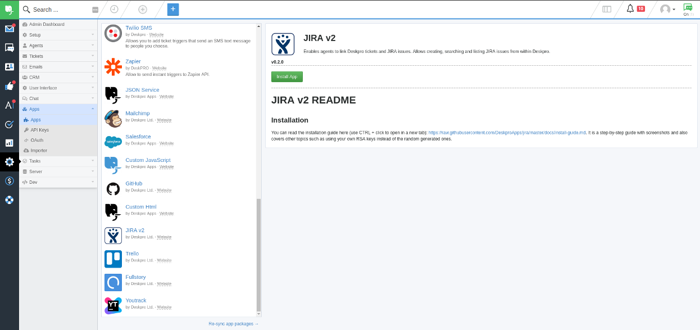
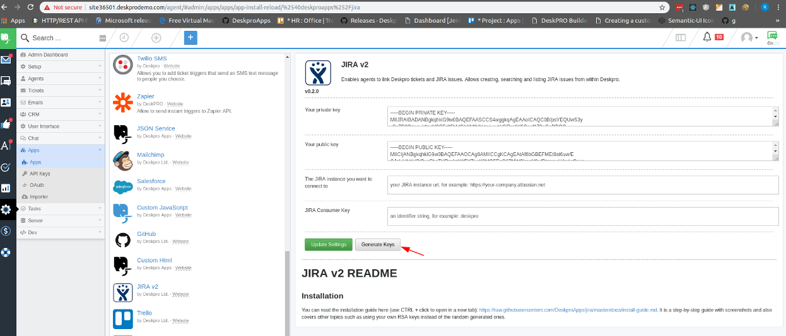
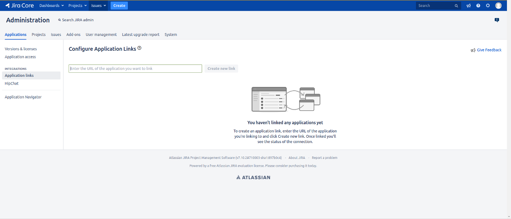
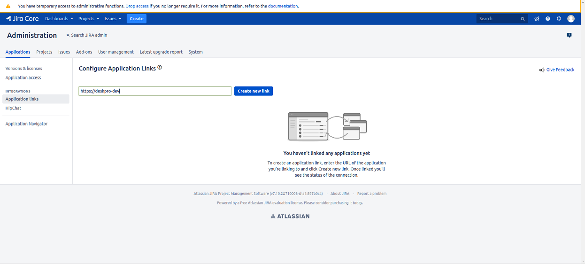
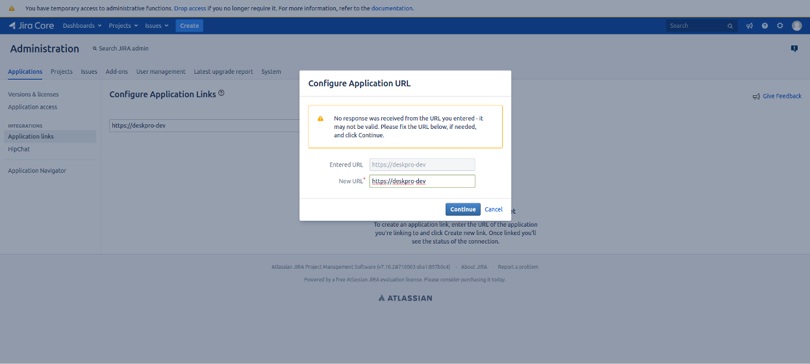
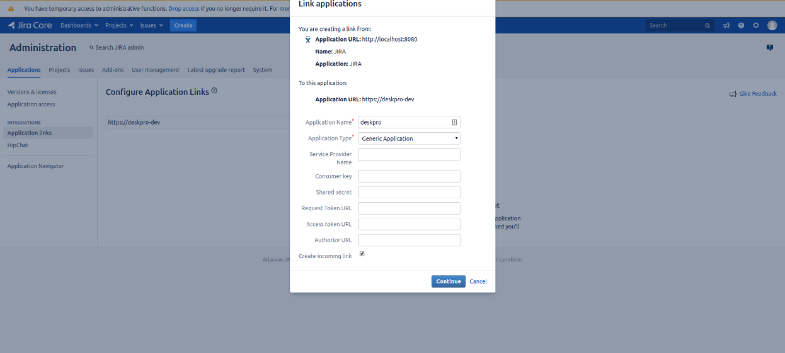

# JIRA v2 README

## Installation

       
1. Install the JIRA App in Deskpro

    1. Install the application
     
        Login to your Deskpro instance, then navigate to `Admin`, then click `Apps` from the `Apps` menu. Scroll down and choose `JIRA v2` then click `Install App`
        
        
        
    2. Configure the application
    
        - Use your own keys or click `Generate Keys` to have Deskpro generate a pair for you        
        - Fill the `The JIRA instance you want to connect to` field with the root url to your JIRA server for example: `https://your-company.atlassian.net` if you are using the cloud version        
        - Fill the `JIRA Consumer Key` field and remember the value, for example use: deskpro
        
        
        
        Don't click `Update setting` yet. We have to configure the app connection in JIRA.
        
        Click `Update settings` and give your consent in the pop-up that appears to authorize the connection between the app and JIRA. 
        Congratulations! You can now link JIRA issues from inside Deskpro.          
     
2. Configure the app connection in JIRA

    1. Navigate to `Applications` page
     
        Log in to your JIRA instance, click the settings menu (small cog wheel next to your profile bage on the top right corner of the page) and choose `Applications`. You should arrive at a page that looks like this:
        
        
        
    2. Configure an Application Link
    
        From the `Integrations` section choose `Application links` and fill the url of your Deskpro instance in the `Create new link` input box:
        
        
        
        If you receive a warning the url being invalid although you enter it correctly, it's safe to click `Continue` and ignore it
        
        
    
    3. Link Applications
        
        Fill in the fields as shown in the image below and make sure you enable `Create incoming link` then click `Continue`
        
        
        
    4. Fill in the incoming link details
        
        You'll have to **remember** the `Consumer Key` because you'll need it when installing the app in Deskpro. 
        Copy the contents of the `public.pem` file we generated at the beginning in the `Public Key` field.

4. Install the JIRA App in Deskpro

    1. Install the application
     
        Login to your Deskpro instance, then navigate to `Admin`, then click `Apps` from the `Apps` menu. Scroll down and choose `JIRA v2` then click `Install App`
        
        
        
    2. Configure the application
    
        - Fill the `Rsa private key` field with the contents of the `private.pem` file we generated in step 2
        - Fill the `Rsa public key` field with the contents of the `public.pem` file we generated in step 2        
        - Fill the `JIRA instance url` field with the url to the JIRA server we used in step 3, for example: `https://your-company.atlassian.net` if you are using the cloud version        
        - Fill the `JIRA Consumer Key` field with the value of the `Consumer Key` field you remember from step 3
        
        
        
        Click `Update settings` and give your consent in the pop-up that appears to authorize the connection between the app and JIRA. 
        Congratulations! You can now link JIRA issues from inside Deskpro.          
    
 
